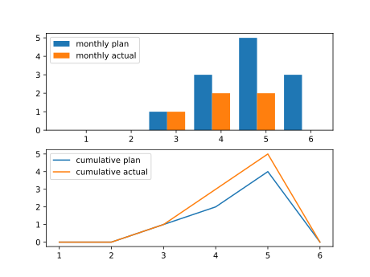

=======================================
2022-06-29
=======================================
自主导航消防机器人（40D）
=======================================
成员
----------------

:产品经理:
   卢宗胜

:产品项目经理:
   卢宗胜

:销售代表:
   黄继球

:工程代表:
   王惠远

:采购代表:
   武强

:研发代表（测试）:
   方李盛

时间线
----------------

.. uml::

   @startuml
   left to right direction
   title PERT: 自主导航消防机器人（40D）
   object 演示 #WHITE {
   2022-07-15
   }
   object 第二次拍摄视频 #GREEN {
   2022-06-20
   }
   object 站内调试完成 #GREEN {
   2022-05-30
   }
   object 拍摄视频 #GREEN {
   2022-03-10
   }
   拍摄视频 --> 站内调试完成
   站内调试完成 --> 第二次拍摄视频
   第二次拍摄视频 --> 演示
   @enduml

本周摘要
----------------

:研发、制造进展:
   对客户进行站内培训，完成。

:市场、销售、交付进展:
   完成第2次视频拍摄。初定了下一步演示计划在7月中旬。

决议、备忘录
----------------

- 无

人力资源
----------------

材料费用
----------------

产品成本
----------------

风险
----------------

.. list-table:: 风险跟踪表
   :header-rows: 1
   :widths: 4 15 15 15 25
   :stub-columns: 1

   *  -  风险级别
      -  风险描述
      -  风险影响
      -  风险策略
      -  关联工作包
   *  -  中
      -  还未与客户达成有效沟通，客户态度不明确
      -  有演示推迟的风险，继而影响按时完成验收的目标
      -  请营销尽快与客户约定演示时间
      -  演示

下一步计划
----------------

.. list-table:: 下一步计划表
   :header-rows: 1
   :widths: 4 15 15 15
   :stub-columns: 1

   *  -  WBS
      -  工作包名称
      -  计划开始时间
      -  计划结束时间

消防高喷机器人（FG100）
=======================================
成员
----------------

:产品经理:
   卢宗胜

:产品项目经理:
   卢宗胜

:SE:
   李剑涛

:研发项目经理:
   束志松

:营销代表:
   程逖

:销售代表:
   杨娟

:工程代表:
   徐国华

:采购代表:
   武强

:制造代表:
   崔源

:质量代表:
   杨浩

:SQE:
   朱耀

时间线
----------------

.. uml::

   @startuml
   left to right direction
   title PERT: 消防高喷机器人（FG100）
   object 组网方案确认和超声波需求 #GREEN {
   2022-03-10
   }
   object 超声波改造完成 #GREEN {
   2022-04-30
   }
   object 双确认功能开发完成 #GREEN {
   2022-06-24
   }
   object 演示验收 #WHITE {
   2022-07-11
   }
   object 无线充电测试完成 #WHITE {
   2022-07-15
   }
   object 38套生产完毕 #WHITE {
   2022-09-15
   }
   object 38套交付 #WHITE {
   2022-11-30
   }
   组网方案确认和超声波需求 --> 超声波改造完成
   超声波改造完成 --> 双确认功能开发完成
   双确认功能开发完成 --> 演示验收
   无线充电测试完成 --> 38套生产完毕
   38套生产完毕 --> 38套交付
   @enduml

本周摘要
----------------

:研发、制造进展:
   完成了双确认功能开发及系统测试；具备演示水平；
地市集控已通网，在测试中；
无线充电供应商已完成整改，计划下周到国兴验证；

:市场、销售、交付进展:
   与客户对接演示方案，初步敲定演示时间在7月第2周；

决议、备忘录
----------------

- 与客户沟通初步决定7月第2周演示验收。

人力资源
----------------

材料费用
----------------

.. figure:: ../_static/2022-06-29-消防高喷机器人（FG100）-cost.svg

产品成本
----------------

风险
----------------

.. list-table:: 风险跟踪表
   :header-rows: 1
   :widths: 4 15 15 15 25
   :stub-columns: 1

   *  -  风险级别
      -  风险描述
      -  风险影响
      -  风险策略
      -  关联工作包
   *  -  中
      -  首轮测试结果不合格，第二轮仍存在不合格风险
      -  影响38套供应商的确认，以致影响38套交付及回款目标。
      -  储备第二供应商
      -  无线充电测试完成

下一步计划
----------------

.. list-table:: 下一步计划表
   :header-rows: 1
   :widths: 4 15 15 15
   :stub-columns: 1

   *  -  WBS
      -  工作包名称
      -  计划开始时间
      -  计划结束时间
   *  -  4.0
      -  演示验收
      -  2022-06-30
      -  2022-07-11

项目A
=======================================
成员
----------------

:产品经理:
   <产品经理姓名>

:产品项目经理:
   <产品项目经理姓名>

:SE:
   <name>

:研发项目经理:
   <name>

:营销代表:
   <name>

:销售代表:
   <name>

时间线
----------------

.. uml::

   @startuml
   left to right direction
   title PERT: 项目A
   object task1 #GREEN {
   2022-04-05
   }
   object task2 #GREEN {
   2022-05-30
   }
   object task3 #GREEN {
   2022-06-25
   }
   object task4 #RED {
   2022-06-30
   }
   object task5 #WHITE {
   2022-07-10
   }
   task1 --> task2
   task2 --> task3
   task3 --> task4
   task4 --> task5
   @enduml

本周摘要
----------------

:研发、制造进展:
   本周研发、制造进展样例

:市场、销售、交付进展:
   本周市场、销售、交付进展样例

决议、备忘录
----------------

- 备忘录样例1

- 备忘录样例2

人力资源
----------------

材料费用
----------------

产品成本
----------------

.. figure:: ../_static/2022-06-29-项目A-budget.svg

风险
----------------

.. list-table:: 风险跟踪表
   :header-rows: 1
   :widths: 4 15 15 15 25
   :stub-columns: 1

   *  -  风险级别
      -  风险描述
      -  风险影响
      -  风险策略
      -  关联工作包
   *  -  中
      -  风险描述3
      -  风险影响3
      -  风险策略1
      -  task3

   *  -  中
      -  风险描述4
      -  风险影响4
      -  风险策略2
      -  task4

   *  -  高
      -  风险描述5
      -  风险影响5
      -  风险策略3
      -  task5

下一步计划
----------------

.. list-table:: 下一步计划表
   :header-rows: 1
   :widths: 4 15 15 15
   :stub-columns: 1

   *  -  WBS
      -  工作包名称
      -  计划开始时间
      -  计划结束时间
   *  -  3.0
      -  task3
      -  2022-06-15
      -  2022-06-25

   *  -  4.0
      -  task4
      -  2022-06-20
      -  2022-06-30

   *  -  5.0
      -  task5
      -  2022-06-25
      -  2022-07-10

项目B
=======================================
成员
----------------

:产品经理:
   <产品经理姓名>

:产品项目经理:
   <产品项目经理姓名>

:SE:
   <name>

:研发项目经理:
   <name>

:营销代表:
   <name>

:销售代表:
   <name>

时间线
----------------

.. uml::

   @startuml
   left to right direction
   title PERT: 项目B
   object task1 #GREEN {
   2022-04-05
   }
   object task2 #GREEN {
   2022-05-30
   }
   object task3 #GREEN {
   2022-06-25
   }
   object task4 #RED {
   2022-06-30
   }
   object task5 #WHITE {
   2022-07-10
   }
   task1 --> task2
   task2 --> task3
   task3 --> task4
   task4 --> task5
   @enduml

本周摘要
----------------

:研发、制造进展:
   本周研发、制造进展样例

:市场、销售、交付进展:
   本周市场、销售、交付进展样例

决议、备忘录
----------------

- 备忘录样例1

- 备忘录样例2

人力资源
----------------

材料费用
----------------

产品成本
----------------

风险
----------------

.. list-table:: 风险跟踪表
   :header-rows: 1
   :widths: 4 15 15 15 25
   :stub-columns: 1

   *  -  风险级别
      -  风险描述
      -  风险影响
      -  风险策略
      -  关联工作包
   *  -  中
      -  风险描述3
      -  风险影响3
      -  风险策略1
      -  task3

   *  -  中
      -  风险描述4
      -  风险影响4
      -  风险策略2
      -  task4

   *  -  高
      -  风险描述5
      -  风险影响5
      -  风险策略3
      -  task5

下一步计划
----------------

.. list-table:: 下一步计划表
   :header-rows: 1
   :widths: 4 15 15 15
   :stub-columns: 1

   *  -  WBS
      -  工作包名称
      -  计划开始时间
      -  计划结束时间
   *  -  3.0
      -  task3
      -  2022-06-15
      -  2022-06-25

   *  -  4.0
      -  task4
      -  2022-06-20
      -  2022-06-30

   *  -  5.0
      -  task5
      -  2022-06-25
      -  2022-07-10

